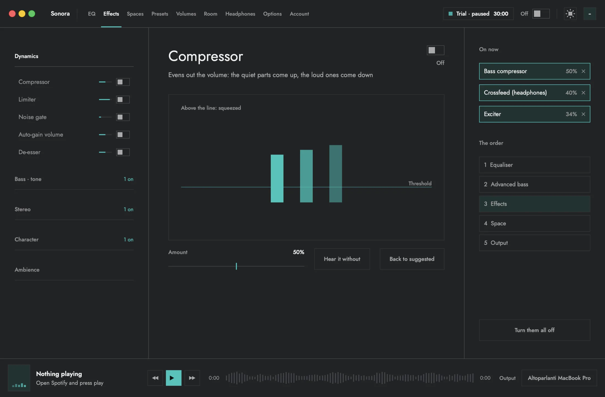
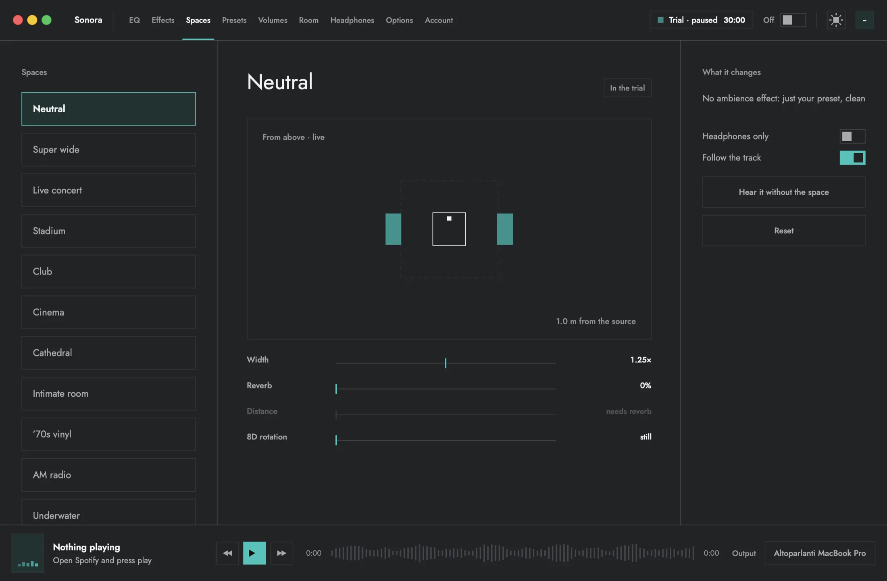
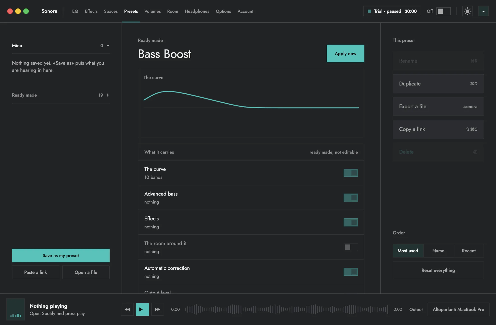
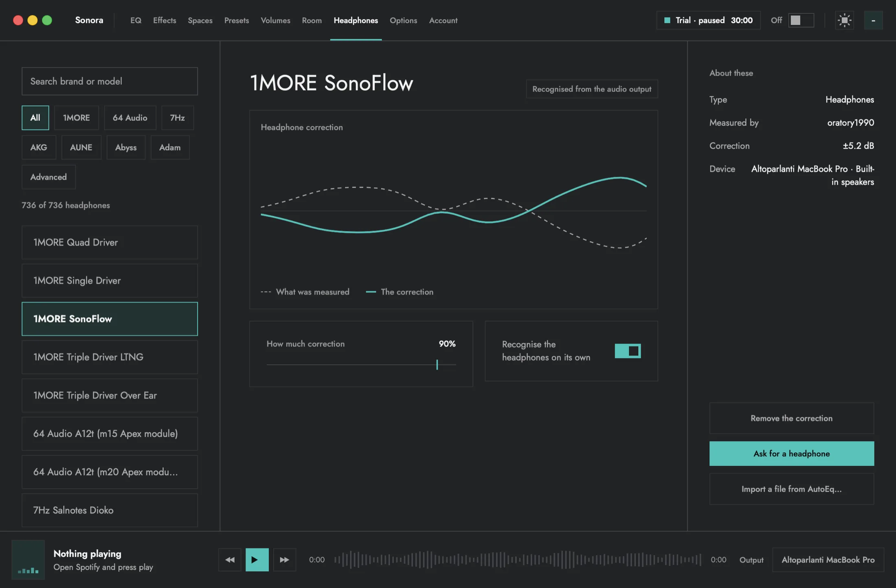

# Sonora

**A system equalizer for macOS. It shapes the sound of the whole Mac, not one
app at a time.**

[Website](https://eqsonora.com) · [Download](https://eqsonora.com/download) · [Pricing](https://eqsonora.com/pricing) · [Discussions](../../discussions) · [Contributing](CONTRIBUTING.md)

---

> **This repository is the public home of Sonora: documentation, screenshots,
> ideas and discussion.** The app's source code is private and is not here.
> Everything below describes what the app does and how it is built, at the
> level a developer would want to know before trusting it with their audio.

## Contents

- [What it is](#what-it-is)
- [Features](#features)
- [How it works](#how-it-works)
- [The AI assistant, and why it cannot hurt you](#the-ai-assistant-and-why-it-cannot-hurt-you)
- [Privacy: what leaves your Mac](#privacy-what-leaves-your-mac)
- [Install](#install)
- [Free plan and paid plan](#free-plan-and-paid-plan)
- [Languages](#languages)
- [Design](#design)
- [Get involved](#get-involved)
- [Credits](#credits)
- [License](#license)

## What it is

Sonora lives in the macOS menu bar. Everything that comes out of your Mac -
Spotify, Apple Music, YouTube in a browser, Netflix, a game, a call - goes
through one processing chain before it reaches your speakers or headphones.
You drag a curve and hear the change while the music keeps playing.

It is not a plugin for one player and it does not need a virtual audio driver
installed by hand.

## Features

### Equalizer

- **10 bands** from 31 Hz to 16 kHz, or **15, 20, 31 and 41 bands** spread from
  20 Hz to 20 kHz. Changing the grid resamples your curve instead of throwing
  it away.
- A curve you drag directly, with the **live spectrum** of what is playing
  drawn behind it.
- An **automatic preamp** that lowers the level as much as the curve raises it,
  and a **safety limiter** that is always on, so boosting never turns into
  clipping.
- A signal panel that shows headroom and counts clipped samples, if you want
  the numbers.

### Bass, on its own page

One shelf plus four bands made only for the low end - **Sub, Punch, Body,
Mud** - and a subsonic filter that removes rumble you cannot hear but your
speakers still try to play.

### Effects

**24 effects**, each explained in plain words with a bar that shows how hard it
is working right now. Among them: compressor, limiter, de-esser,
**crossfeed** and **mono bass** for headphones, and **8D rotation**, where the
sound circles slowly around your head.

### Spaces

**13 scenes** - concert, stadium, club, cinema, cathedral and more - in one
click. A space changes only the room around the sound (width, reverb,
distance). It never touches your equalizer curve.

### Presets

Factory presets, your own (save, rename, delete), and presets are remembered
**per audio output**: your headphones and your desk speakers each keep their
own sound.

### Headphone correction

Sonora ships **736 headphone correction curves**, and recognises many models on
its own from the name macOS reports. Models not in the list can be imported
from an AutoEq file you download yourself. You choose how much of the
correction to apply, and you can ask for a model to be added.

### Room correction

Speakers sound different in every room. Sonora measures yours using an
**iPhone as the microphone**, in four guided steps that take about two minutes:

1. silence at your listening position, to measure the room's own noise;
2. test noise at the same position, which is the sound as you hear it;
3. and 4. the phone about 20 cm in front of each speaker, which gives a
   reference that separates the room from the phone's microphone.

The correction is detailed below 300 Hz, where rooms cause most of their
trouble, and only a gentle tilt above. Rooms are saved and recalled
automatically from the audio output. Nothing is recorded: only the loudness of
each band is sent from the phone to the Mac.

### Automatic correction

Turn it on and Sonora analyses the track that is playing and adapts the curve
in real time, which a fixed equalizer cannot do. There is also a "show only"
mode that displays what it would change without applying it.

### Volume per app, scenes and rules

macOS does not let one app set another app's volume. Sonora does it by
capturing each app separately and sending it back out with the gain you
choose: turn the browser down without touching the music, keep calls above
everything else. Volumes can be saved as **scenes**, and **rules** can apply
them on their own.

### A music player on every page

Every page has a player at the bottom for what is playing (Spotify, Apple
Music), plus a full-screen mode with a backdrop that follows the music.

### A remote on your phone

Scan a code once and your phone becomes a remote for Sonora on that Mac:
equalizer, presets, spaces, playback and volume. The remote is a web page, not
another app to install, and it has to be approved on the Mac first.

### Two ways to use it

- **Advanced**: the full window, three columns, ten pages.
- **Minimal**: a small panel under the menu-bar icon with the equalizer as
  faders, the band count, the bass, the preset and automatic correction. Nothing
  else, for when that is all you need.

Both come in a **dark** and a **light** appearance.

## How it works

| | |
|---|---|
| **App** | Native Swift and SwiftUI. No Electron, no web view for the interface. A menu-bar app (`LSUIElement`), so there is no Dock icon. |
| **Audio capture** | Core Audio **process taps**, the system API Apple added in macOS 14.4. That is why 14.4 is the minimum. Sonora captures the system's output, processes it, and plays it to the device you chose. |
| **Processing** | Its own DSP chain in Swift, running in real time: equalizer, bass, effects, space, headphone and room correction, preamp, limiter. |
| **Build** | Universal binary: Apple Silicon and Intel. |
| **Updates** | Built into the app. It checks for a newer version and installs it only when you say so. |
| **Site, account, payments** | TypeScript on Cloudflare Workers. Payments go through Stripe; card details never reach Sonora's servers. |
| **Remote** | A web page on your phone, paired with the Mac through a one-time code and an approval on the Mac. |

A few engineering rules the project holds itself to:

- **A control is not proven by its code.** Every slider is tested by dragging
  it for real and counting how many distinct values reached the audio engine
  during the drag.
- **Every text in a catalogue, every key in every language.** A missing
  translation stops the build.
- **One source of truth for the price.** What the app and the site show is read
  from the payment provider, so the page and the charge cannot disagree.
- **Contrast is measured.** Every colour that carries text is checked at 4.5:1
  or better on every surface it can appear on.

## The AI assistant, and why it cannot hurt you

Sonora has an optional chat panel: describe the sound you want ("it booms too
much", "make it softer") and it proposes changes. It can talk to a **local
model through Ollama** or to **Claude or GPT with your own API key**. Claude
Desktop can also drive the same tools.

The design assumes the model **can** be fooled - it reads track titles written
by strangers - and limits what happens if it is:

1. **A closed list of 18 audio-only tools.** No files, no shell, no network, no
   keychain, no account. Those tools do not exist to be misused.
2. **You choose the areas** it may touch (equalizer, bass, effects, spaces,
   automatic correction, system volume, room). Areas you do not tick are not
   even shown to the model. System volume and room measurement are off by
   default.
3. **Every argument is rebuilt**, not just validated. A field the model
   invents has no path into the audio engine.
4. **Gain ceilings** protect your ears: never more than +6 dB in one step,
   never past +9 dB.
5. **Text from outside is never an instruction.** Titles and device names are
   fenced off as data.
6. **Hear before you keep.** Every change goes into a trial on top of a
   snapshot of the previous sound. You can switch between the two live, and
   nothing is saved until you apply it.

On the connection side: Ollama is accepted **only on loopback** (this Mac),
Claude and OpenAI **only over HTTPS**, redirects are refused, your API key is
stored in the **macOS keychain** and never synced, and the Claude Desktop
bridge uses a **Unix socket readable only by your user**, not a network port.

> Even if the model is fooled, the worst that happens is the music sounds bad,
> and you hear it before you keep it.

## Privacy: what leaves your Mac

- **Your audio never leaves the Mac.** Processing is local.
- **No usage tracking about you.** The server counts anonymous requests, with
  no IP address and no identifier stored.
- **The account is optional.** It unlocks the paid plan on your Macs and syncs
  your settings. Without it, settings stay on this Mac.
- **The AI assistant is off until you set it up.** With Ollama, nothing leaves
  the Mac; with Claude or GPT, requests go directly from your Mac to that
  provider with your key.
- **Room measurement** sends only per-band loudness from the phone, never a
  recording.
- **Feedback** from inside the app is sent only when you press send.

The website uses Google Analytics. In the EEA and the UK it asks for consent
first, with two equal buttons, and advertising storage stays denied
everywhere. Full details: [privacy notice](https://eqsonora.com/privacy).

## Install

**Requirements:** macOS 14.4 or later, Apple Silicon or Intel.

1. Download the DMG from **[eqsonora.com/download](https://eqsonora.com/download)**.
2. Drag Sonora into Applications and open it. It appears in the menu bar.

> **Heads up:** the app is not notarised by Apple yet. The first time you open
> it, macOS blocks it. Go to **System Settings -> Privacy & Security** and press
> **Open Anyway**. This is needed only once: updates installed from inside the
> app do not go through this step.

macOS will ask for permission to capture audio, which is how a system-wide
equalizer works.

## Free plan and paid plan

**Sonora is free everywhere in the world.**

- **Free, forever:** the equalizer and the presets.
- **30 minutes a day with every feature**, to try everything. The minutes come
  back every day at 00:00 UTC. When they run out, paid features pause and
  nothing you set up is lost.
- **Sonora+** removes every time limit on every Mac your plan covers, with a
  14-day refund on the first payment.

The paid plan can currently be **purchased only from Switzerland and
Liechtenstein**. The reason is regulatory, not technical: selling elsewhere
requires tax registrations and legal representation that are not set up yet.
Everywhere else Sonora runs on the free plan, with no paywall pushed at you.
The current price, in Swiss francs, is always on
[eqsonora.com/pricing](https://eqsonora.com/pricing).

## Languages

The app speaks **12 languages**: English, German, French, Italian, Spanish,
Portuguese, Dutch, Polish, Turkish, Japanese, Chinese and Korean. The website
is in English, German, French and Italian.

Spotted a translation that sounds wrong? That is a very welcome contribution,
see [CONTRIBUTING.md](CONTRIBUTING.md).

## Design

Flat surfaces separated by one-point rules, square corners, one orange accent,
and no glass, blur or glow. Motion is short and precise, and it switches off
with **Reduce Motion**. Labels are told apart by size, weight and colour, never
by letter spacing or capitals.

## Get involved

This project listens. There is no code to send a pull request against, but
there is a lot you can do:

| you want to | go to |
|---|---|
| propose an idea or a feature | [Discussions -> Ideas](../../discussions/categories/ideas) |
| ask a question | [Discussions -> Q&A](../../discussions/categories/q-a) |
| say what you think, share your setup | [Discussions -> General](../../discussions/categories/general) |
| report a bug | [Issues](../../issues/new/choose), or the feedback button inside Sonora |
| ask for a headphone model | [Issues -> Headphone request](../../issues/new/choose) |
| fix a typo in these docs | a pull request on this repository |
| report a security problem | **privately**, see [SECURITY.md](SECURITY.md) |

Read [CONTRIBUTING.md](CONTRIBUTING.md) first, and be decent to each other:
[CODE_OF_CONDUCT.md](CODE_OF_CONDUCT.md).

## Credits

- Headphone correction curves derived from measurements by **oratory1990**,
  processed through **[AutoEq](https://github.com/jaakkopasanen/AutoEq)** by
  Jaakko Pasanen (MIT licence).
- Interface type: **Jost**. Website type: **Archivo**. Both under the SIL Open
  Font License.

## License

The contents of this repository (this README, the other documents and the
images) are © Sonora. The Sonora application, its source code and its brand are
not licensed for reuse. This repository exists to describe the product and to
talk with the people who use it, not to distribute it.
